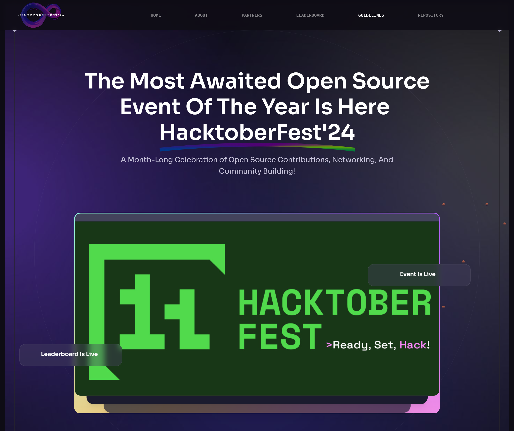

# Hacktoberfest'24 Official Website

Welcome to the official repository for **Hacktoberfest'24**, a collaborative event organized by **Google Developer Groups on Campus at Graphic Era University** in partnership with **Vaunt.dev**. This repository forms the core of the Hacktoberfest'24 initiative and is open for contributions from everyone! Whether you're a beginner or a seasoned developer, your contributions are valued here.



---

## Table of Contents
- [About Hacktoberfest'24](#about-hacktoberfest24)
- [Partnership with Vaunt.dev](#partnership-with-vauntdev)
- [How to Contribute](#how-to-contribute)
    - [Tier 1: Core Repository Contributions](#tier-1-core-repository-contributions)
    - [Tier 2: External Repository Contributions](#tier-2-external-repository-contributions)
- [Leaderboard and Participants Log](#leaderboard-and-participants-log)
- [Badges and Recognition](#badges-and-recognition)
- [Getting Started](#getting-started)
- [Code of Conduct](#code-of-conduct)
- [License](#license)

---

## About Hacktoberfest'24

Hacktoberfest'24 is part of the global, month-long Hacktoberfest celebration of open source software by **DigitalOcean**. This particular initiative, hosted by the **Google Developer Groups on Campus at Graphic Era University**, provides a welcoming space for developers of all skill levels to contribute to open-source projects.

This repository offers a **2-Tier Contribution System**:
- **Tier 1**: Contribute directly to this core repository.
- **Tier 2**: Contribute to **ANY** other open-source repository of your choice and get recognized here.

---

## Partnership with Vaunt.dev

We are proud to partner with **Vaunt.dev**, a powerful platform designed to enhance the developer experience. Thanks to Vaunt, participants in Hacktoberfest'24 can earn **limited edition Holopin badges** as a reward for their contributions.

Vaunt.dev not only sponsors this event but also helps manage the **leaderboard** and reward system for participants.

---

## How to Contribute

Hacktoberfest'24 encourages contributions from everyone, regardless of their experience level. You can choose between two different contribution tiers:

### Tier 1: Core Repository Contributions

In this tier, you contribute directly to the official Hacktoberfest'24 core repository. Follow these steps:

1. **Find an Issue**: Check the [Issues tab](../../issues) and look for issues with `[ISSUE]` in the title. These are curated by the maintainers.
2. **Create an Issue**: If you find a bug or want to propose a feature, you can create a new issue with `[ISSUE]` in the title.
3. **Submit a Pull Request**: Once you've made the necessary changes, submit a pull request following this naming convention:
    ```
    pr-add-<your-name>-<PR-number>
    ```
    Example: `pr-add-johndoe-123`.

### Tier 2: External Repository Contributions

You also have the freedom to contribute to any **external open-source repository** of your choice. Here’s how:

1. **Choose an External Repository**: Find an open-source repository you want to contribute to.
2. **Get Your PR Merged**: Submit a pull request to the external repository and get it merged successfully.
3. **Create an Issue in This Repo**: Once your external PR is merged, head over to the [Issues tab](../../issues) in this repository, and create an issue titled `[PR EXTERNAL] <your name>`.
4. **Submit Your Details**: In your issue, provide the following information:
    - Your Name
    - GitHub Username
    - PR Number
    - Link to the PR
    - A brief description of your contribution
5. **Update Participants Log**: Once verified by a maintainer, you will be instructed to update the `participants/participants.js` file (see below for more details).

---

## Leaderboard and Participants Log

After your contribution (either in Tier 1 or Tier 2) has been successfully verified, you will be featured on our **Leaderboard**! Here's how to update the `participants/participants.js` file:

1. Open `participants/participants.js`.
2. Add your details in the following format:
    ```js
    {
        id: "<incremental id>",
        name: "<Your Name>",
        university: "<Your University>",
        img: <your image variable>,
        pr: [<PR number>],
        prLink: ['<PR link>'],
    },
    ```
3. Make sure to follow the structure carefully, including your PR number and link.

Example:
```js
{
    id: "1",
    name: "Ayush ChamoliK1",
    university: "Graphic Era University",
    img: ayush,
    pr: [1],
    prLink: ['#link1'],
},
```

This will add you to the leaderboard where you'll compete with others for top spots!

---

## Badges and Recognition

Thanks to our partner **Vaunt.dev**, you can earn special **Holopin badges** based on your contributions during Hacktoberfest'24. Badges are awarded based on the following contribution levels:

- **Participation Badge**: For making at least 1 successful contribution (either Tier 1 or Tier 2).
- **Active Contributor Badge**: For making 5 successful contributions.
- **Master Contributor Badge**: For making 10 or more successful contributions.

Once verified, badges will be distributed via email or directly to your account.

---

## Getting Started

Here’s how you can set up the repository locally:

1. **Fork the repository** to your own GitHub account.
2. **Clone the repository** to your local machine:
    ```bash
    git clone https://github.com/iamAyushChamoli/hacktoberfest-24.git
    ```
3. **Navigate into the directory**:
    ```bash
    cd hacktoberfest-24
    ```
4. **Install dependencies** (if applicable):
    ```bash
    npm install
    ```
5. **Create a new branch** for your changes:
    ```bash
    git checkout -b <your-branch-name>
    ```
6. **Make your changes**, commit, and push:
    ```bash
    git add .
    git commit -m "Your message here"
    git push origin <your-branch-name>
    ```

7. **Create a pull request** from your GitHub repository.

For detailed contribution guidelines, check our [CONTRIBUTING.md](./CONTRIBUTING.md) file.

---

## Code of Conduct

We expect all contributors to follow our [Code of Conduct](./CODE_OF_CONDUCT.md) in order to create a safe and welcoming environment for everyone. Violations of the Code of Conduct will be taken seriously.

---

## License

This project is licensed under the MIT License. See the [LICENSE](./LICENSE) file for more details.

---

We’re excited to see your contributions! Let’s make Hacktoberfest'24 a great success together 🚀!
